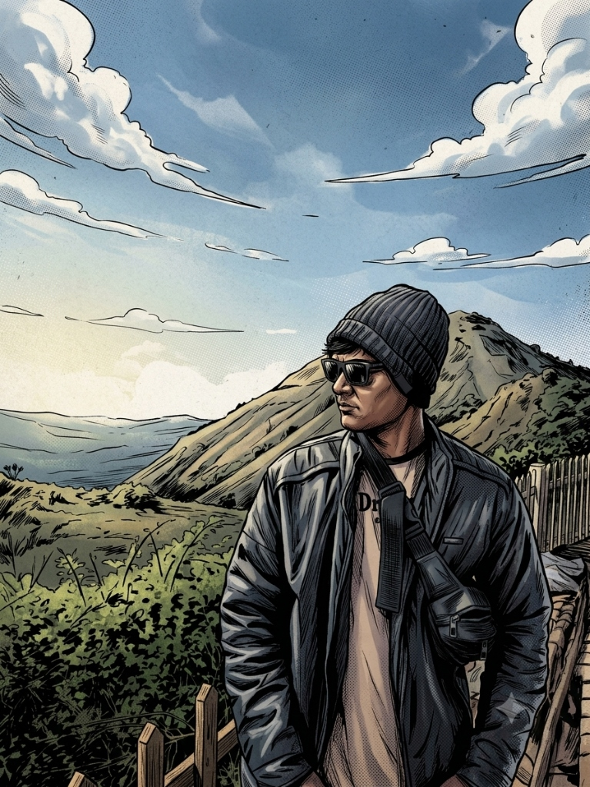

# THE DEION BERNARD CHRONICLES 🦸‍♂️

> A premium, fully interactive **comic-book portfolio** built with Next.js 14, TypeScript, Tailwind CSS, and Framer Motion.



---

## 🎨 Concept

**MY PORTFOLIO = A COMIC BOOK**

Every page is a different chapter. Every interaction feels physical, playful, and cinematic.

> *"BUILD. LEARN. CREATE. EXPLORE."*

---

## ✨ Features

- 📖 **Comic Book Intro Animation** — Issue #000 with multilingual panels (English · Tamil · French)
- 🕷️ **Spider-Man Web Swing** — Full-screen pendulum animation on the homepage
- 🎭 **Marvel Character System** — Each page has a floating Marvel hero
- 🃏 **Infinite Moving Cards** — Auto-scrolling comic panels on Movies, Blogs & Music pages
- 🎵 **Music Player** — Real 30-second iTunes preview streams
- 💬 **Comic Thought Bubble** — Animated speech/thought interaction
- 🎮 **Floating Comic Dock** — Navigation dock revealed after intro
- 📱 **Fully Responsive** — Desktop, Tablet, Mobile

---

## 🛠️ Tech Stack

| Tech | Purpose |
|------|---------|
| Next.js 14 | Framework |
| TypeScript | Type Safety |
| Tailwind CSS | Styling |
| Framer Motion | Animations |
| Lucide React | Icons |
| Google Fonts (Bangers, Space Grotesk) | Comic Typography |

---

## 🚀 Running Locally

```bash
# Install dependencies
npm install

# Start development server
npm run dev

# Build for production
npm run build
```

Open [http://localhost:3000](http://localhost:3000)

---

## 📡 Connect

- 🐙 **GitHub**: [github.com/obito993](https://github.com/obito993)
- 💼 **LinkedIn**: [linkedin.com/in/deion-bernard-1515a8284](https://www.linkedin.com/in/deion-bernard-1515a8284/)
- 📧 **Email**: deionbernard3322@gmail.com

---

© 2026 Deion Bernard. THE DEION BERNARD CHRONICLES — Issue #001.
